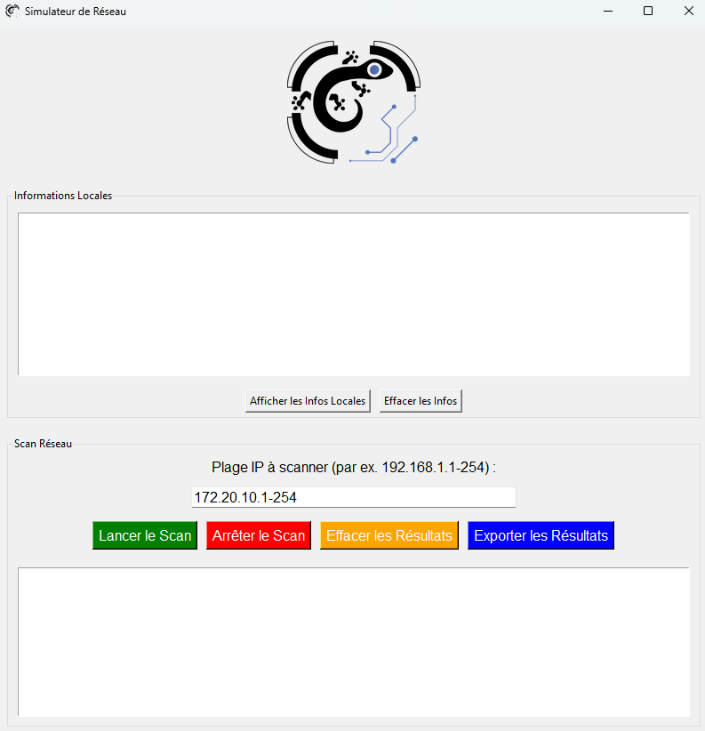

  

# Network Scanner

Network Scanner est un outil conçu pour les professionnels IT et les utilisateurs techniques. Il vous permet d'afficher vos informations réseau locales et de scanner une plage IP pour détecter les appareils actifs, leurs noms d'hôtes, et les ports ouverts.

---

## Fonctionnalités

- **Informations locales** :
  - Affiche votre adresse IP locale, passerelle, DNS, masque de sous-réseau, et plus.
  - Fournit l'adresse IP publique.

- **Scan de réseau** :
  - Analyse une plage IP personnalisable.
  - Identifie les appareils actifs avec leurs noms d'hôtes et ports ouverts.

- **Exportation des résultats** :
  - Sauvegarde en **TXT**, **CSV**, ou **PDF**.
  - Ajout d'une bannière et d'un pied de page dans les PDF exportés.

---

## Installation

1. Téléchargez le fichier `Network_Scanner.exe` depuis [Releases](https://github.com/GecKore-Dev/Network-Scanner/releases).
2. Double-cliquez sur le fichier pour lancer l'application. Aucun logiciel supplémentaire requis.

---

## Utilisation

### Informations locales
1. Cliquez sur **"Afficher les Infos Locales"** pour voir les informations réseau de votre machine.
2. Utilisez **"Effacer les Infos"** pour vider l'affichage.

### Scan réseau
1. Entrez une plage IP (ou utilisez la plage par défaut détectée automatiquement).
2. Cliquez sur **"Lancer le Scan"** pour commencer.
3. **"Arrêter le Scan"** permet de stopper le processus.
4. Exportez les résultats au format souhaité en cliquant sur **"Exporter les Résultats"**.

---

## Exemples de résultats exportés

- **TXT** : Rapport avec une signature ASCII artistique.
- **CSV** : Données tabulaires pour une analyse simplifiée.
- **PDF** : Rapport visuel avec une bannière et un pied de page personnalisé.

---

## Captures d'écran

  

---

## Licence

Network Scanner est sous licence [MIT](https://opensource.org/licenses/MIT). Vous êtes libre d'utiliser, de modifier et de distribuer cet outil.

---

  

  Développé par **GecKore-Dev** | [GitHub](https://github.com/GecKore-Dev)

